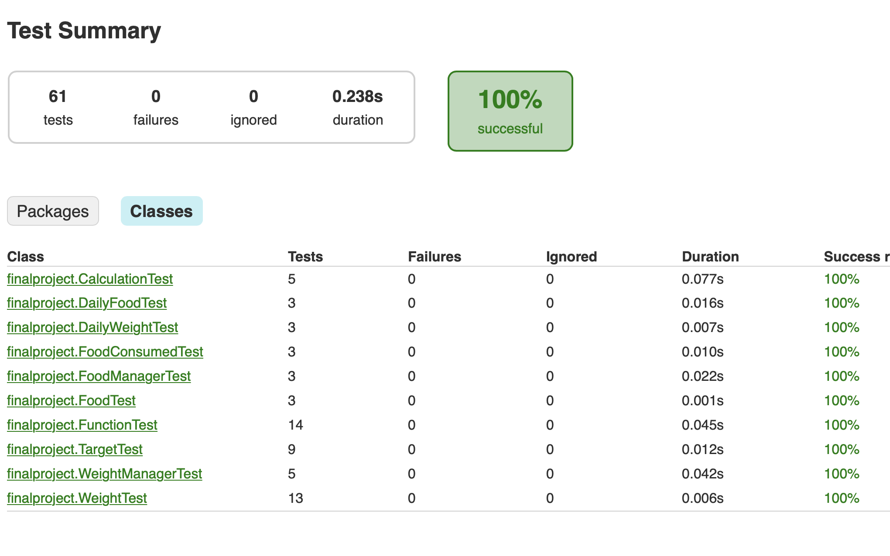
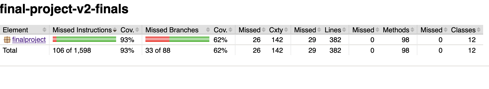

## UML

```mermaid
classDiagram
    DailyFood <|-- FoodConsumed
    JFrame <|-- App
    Target <|-- Food
    DailyWeight <|-- Weight
    class Weight{
      #WeightManager weightManager
      #int id
      #LocalDate date
      #String name
      #double height
      #double weight
      #double targetWeight
      +Weight(int, LocalDate, String, double, double, double)
      +getId()
      +setId()
      +getDate()
      +setDate(LocalDate)
      +getName()
      +setName(String)
      +getHeight()
      +setHeight(double)
      +getWeight()
      +setWeight(double)
      +getTargetWeight()
      +setTargetWeight(double)
      +toString()
    }
    class WeightManager{
        -String newUserWeightFilePath
        -Set<String> generateIds
        +generateRandomNumericIds()
        +existingId()
    }
    class Target{
        #double protein
        #double carb
        #double calories
        #double fat
        +Target(double, double, double, double)
        +getProtein()
        +setProtein(double)
        +getCarb()
        +setCarb(double)
        +getCalories()
        +setCalories(double)
        +getFat()
        +setFat(double)
    }
    class Function{
        #String newUserWeightFilePath
        #String dailyWeightFilePath
        #String dailyFoodFilePath
        #String nutritionFilPath
        #Calculation calculation
        +newUserWeight(int, String, double, double, double)
        +addDailyWeight(int, String, double)
        +createNewDailyWeightCSVFile(Weight)
        +addDailyFood(int, String, Category, double)
        +readFileContents(String)
        +targetConsumption(int)
        +consumptionByCategory(int, int)
        +dailyConsumption(int)
        +stringToCategory(String)
        +nutritionFilter(String, int)
        +weightInfo(int)
        +weightDifference(int)
        +daysUsedApp(int)
        +dayRegister(int)
    }
    class FoodManager{
        #String foodNutritionFilePath
        +addNewFoodNutrition(FoodCategory, String, double, double, double, double)
        +addDailyFood(int, String, Category, int)
        +strToCategory(String)
    }
    class DailyFood{
        #int id
        #LocalDate localDate
        #String name
        #Category category
        #double weight
        +DailyFood(int, String, Category, double)
        +getLocalDate()
        +setLocalDate(LocalDate)
        +getId()
        +setId(int)
        +getName()
        +setName(String)
        +getCategory()
        +setCategory(Category)
        +getWeight()
        +setWeight(double)
        +toString()
    }
    class DailyWeight{
        #int id
        #LocalDate date
        #double todayWeight
        +DailyWeight(int, LocalDate, double)
        +getId()
        +getDate()
        +getWeight()
        +setWeight(double)
        +toString()
    }
    class Calculation{
        #Weight weight;
        #int protein
        #int carb
        #int calories
        #int fat
        +targetConsumption(double)
        +consumptionDiff(Target, Target)
        +weightComparison(int, int)
        +convertNutrition(DailyFood, String[])
        +lbsToKg(double)
    }
    class Category{
        <<Enumeration>>
        BREAKFAST,
        LUNCH,
        DINNER,
        SNACK
    }
    class Food{
        #FoodCategory foodCategory
        #String name
        #double protein 
        #double carb
        #double calories
        #double fat
        +Food(FoodCategory, String, double, double, double, double)
        +getFoodCategory()
        +setFoodCategory(FoodCategory)
        +getName()
        +setName(String)
        +getProtein()
        +setProtein(double)
        +getCarb()
        +setCarb(double)
        +getCalories()
        +setCalories(double)
        +getFat()
        +setFat(double)
        +toString()
    }
    class FoodConsumed{
        #double calories
        #double protein
        #double carb
        #double fat
        +FoodConsumed(int, LocalDate, String, Category, double, double, double, double, double)
        +getCalories()
        +setCalories(double)
        +getProtein()
        +setProtein(double)
        +getCarb()
        +setCarb(double)
        +getFat()
        +setFat(double)
    }
    class FoodCategory{
        <<Enumeration>>
        MAIN,
        MEAT,
        DRINK,
        MISC
    }
    class App{
        #String newUserWeightFilePath
        #String foodNutritionFilePath
        #String weightFilePath
        #String dietFilePath
        -JButton newUserButton
        -JButton backFrontButton
        -JButton registerSubmitButton
        -JButton nutritionButton
        -JButton dietButton
        -JButton registerNutritionButton
        -JTextField nameInput
        -JTextField weightInput
        -JTextField heightInput
        -JTextField targetInput
        -JComboBox<String> existingUserComboBox
        -JPanel userRegisterPanel
        -JPanel frontPanel
        -JPanel centerWrapperPanel
        -JPanel nutritionPanel
        -JPanel nutritionTopPanel
        -JPanel nutritionMidPanel
        -JPanel nutritionBottomPanel
        -JButton nutDietButtom
        -JButton nutInputSubmitButton
        -JTextField nutFoodInput
        -JComboBox<String> nutCategorySelection
        -JComboBox<String> nutFilterBox
        -JLabel newUserRegisterOutput
        -JTextArea outputTextArea
        -JButton nutNewUserButton
        -JButton nutMainButton
        -JButton nutAddButton
        -JButton nutWeightTrackButton
        -JTable nutritionTable
        -JTextField nutNameInput
        -JComboBox<String> nutCategoryInput
        -JTextField nutCarbInput
        -JTextField nutProteinInput
        -JTextField nutCaloriesInput
        -JTextField nutFatInput
        -JPanel dietPanel
        -JPanel dietTopPanel
        -JPanel dietMidPanel
        -JPanel dietBottomPanel
        -JPanel dietMidLeftPanel
        -JPanel dietMidRightPanel
        -JButton dietWeightTrackButton
        -JButton dietMainButton
        -JButton dietNutButton
        -JButton dietSubmitButton
        -JTextField dietIngreInput
        -JTextField dietWeightInput
        -JComboBox<String> dietCategoryBox
        -JTable dietBFTable
        -JPanel weightPanel
        -JPanel weightTopPanel
        -JPanel weightMidPanel
        -JPanel weightBottomPanel
        -JPanel weightMidLeftPanel
        -JPanel weightMidRightPanel
        -JButton weightMainButton
        -JButton weightDietButton
        -JButton weightNutritionButton
        -JButton weightSubmitButton
        -JLabel weightYesterdayDiff
        -JLabel weightFirstDayDiff
        -JLabel weightDays
        -JTextField dailyWeightInput
        -XYSeries series
        -Function function
        -FoodManager
        -Calculation
        -WeightManager
        -int userId
        -String userName
        +App()
        +main(String[] args)
        -initComponents()
        -backToDiet()
        -backToWeight()
        -backToNutrition()
        -backToMain()
        -updateDietText()
        -updateWeightText()
        -weightGraph()
        -createStandardTickUnits()
        -updateNutritionTableByName(String, int)
        -updateNutritionTable()
        -updateDietTable()
        -existingUserCommand()
        #CustomOutputStream()
    }
```

## Test Coverage



```
The test coverage excluede the App.java class, which is mainly for the swing application model and controller
```
## How to run
```
Clone the file to local. Run the main from App.java
User can register by their name, weight, height and target weight want to achieve
Return to the main page and log in to their information page by selecting their name and unique user id
Certain nutrition have been added to the system
More can be added by user themselves by selecting to the 'Nutrition' button
User can keep track what they have eaten on daily basis for certain amount of protein, carbohydrates, calories and fat, if it is reaching the gaining weight's consumption target
User can also keep track of their weight changes.
* Have to update file path correspond to user local path in order to run.*
* Edit file path from 'App.java', 'FoodManager.java', 'Function.java', 'WeightManager.java'.*
More functions will be implement in times. 
```
## Update
```
2024.04.29
new features:
Added specific lbs on Diet page.
Text changed if reached target diet/ min diet.
```


